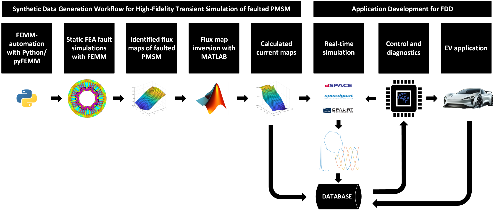

# A High-Fidelity ITSC Fault Dataset for IPMSMs Advancing Diagnostics and Control in Electric Vehicle Powertrains
This data descriptor provides a high-quality dataset and corresponding workflow to model and simulate inter-turn short-circuit (ITSC) faults in interior permanent magnet synchronous machines (IPMSMs) under operational conditions representative of electric vehicle (EV) applications. Obtaining real-world fault data is challenging, as it involves risky and destructive experiments, while finite element method (FEM)-based simulations are resource-intensive and machine-specific. This dataset bridges these gaps by offering flux, current, and torque maps derived from static FEM simulations. These data can support the development of efficient, real-time ITSC fault detection and diagnosis and control techniques, enabling more reliable and safer applications in the automotive and other high-reliability sectors. 

Steps for environment setups:
1. Install FEMM the following FEMM-build: https://www.femm.info/wiki/NewBuild/files.xml?action=download&file=femm42bin_x64_22Oct2023.exe
2. Install python, jupyter notebook extensions in the appropriate IDE 
3. Start setup_env.bat to setup python environment 
4. Start flux_map_identification.ipynb notebook to start identification

